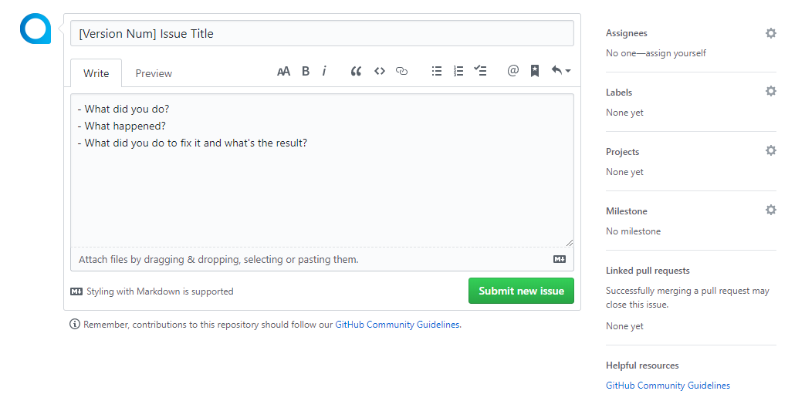

# Contributing Guideline

tooltiplery.js is an open source project and made possible by the open source community.

## Issues

Submit a new issue like this:



### Title

[Version Num] Issus Title

### Content

- What did you do?
- What happened?
- What did you do to fix it and what's the result?

**The more detailed, the better.**

## Code

### JavaScript

#### Variables and Constants

Name as `myVariablesAndConstants`, not:

- `myVariablesandConstants`
- `MyVariablesAndConstants`
- `my_variables_and_constants`

#### Spacing

##### Bad Examples

```javascript
if(!condition)console.log("true!");
for(var i = 0;i<10;i++)console.log(i);
```

##### Good Example

```javascript
if (!condition) { // no white spaces between ( )
    console.log("true!");
    condition = false;
    // four spaces as one tab
} // no whitespace at the end of line or on blank lines

for (var i = 0; i < 10; i++) { console.log(i); }
// always have braces
// go on only one line when there's only one statement

// new line at the end of the file

```

#### Objects and Arrays

##### Bad Examples

```javascript
var obj = { one: 1, two: 2, three: 3, arr: [1, 2, 3] };
```

##### Good Example

```javascript
var obj = {
    one: 1,
    two: 2,
    arr: [ 1, 2 ], // go on only one line and no comma after the last item when there's less than 3 items
    three: 3, // one comma after the last item
};
```

#### Comments

##### Bad Examples

- `console.log("msg"); // LOG A MESSAGE IN CONSOLE`
- `console.log("msg"); // Log a message in console`
- `console.log("msg"); // Log A Message in Console`

##### Good Example

- `console.log("msg"); // log a message in console // always lowercase`

#### JSDoc

This is part of our source code

```javascript
...

/**
 * ```javascript
 * tooltiplery.action.showTooltip({
 *     tooltip: tooltiplery.element.tooltip({...})
 * })
 * ```
 * Popup a tooltiplery tooltip.
 * @param {HTMLDivElement} params.tooltip a **HTML div element** created by `tooltiplery.element.tooltip` or **your own HTML element**.
 * @returns {String} tooltiplery tooltip **element id**.
 */
showTooltip: function (params) {
    ...
},

...
```

1. Show a demo to introduce all the features of the function.
2. Show all the available parameters like this:
   ```javascript
   /** @param {theTypeofTheParam} theNameOfTheParam the description (lowercase & markdown available) */
   ```
3. Show what the function will return:
   ```javascript
   /** @returns {theTypeofTheReturn} the description (lowercase & markdown available) */
   ```
